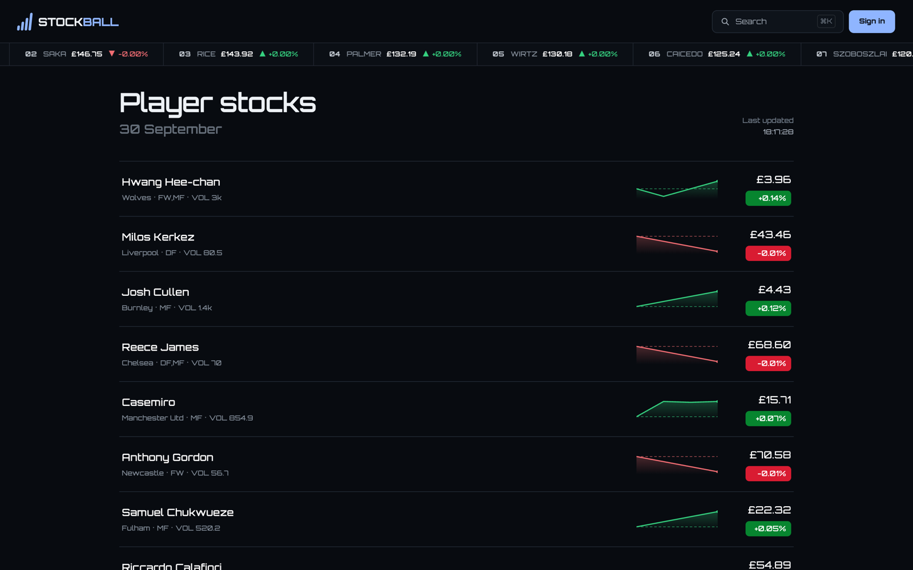
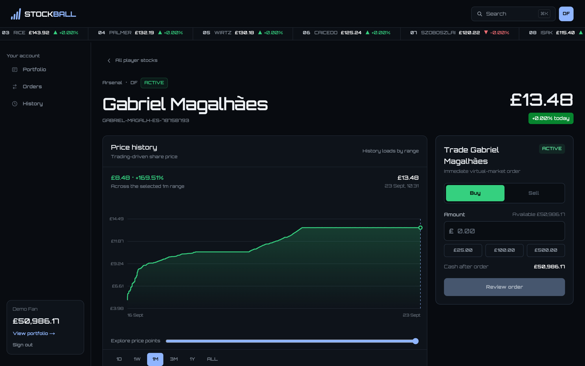
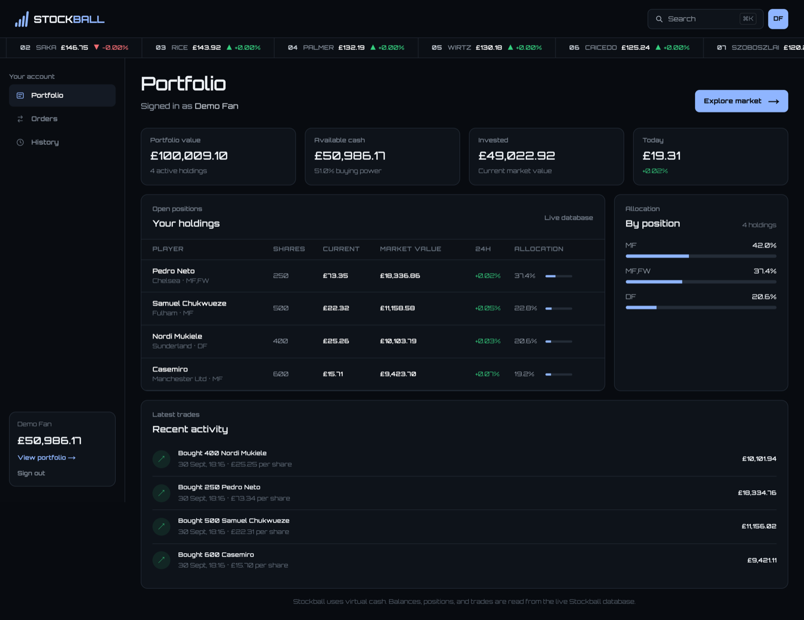

# Stockball

**A virtual-cash stock market for Premier League players.**

Stockball turns every Premier League player into a tradable share. Fans buy and sell player
stocks with virtual cash, watch prices move with demand, and track how their portfolio performs
across the season. There is no order book and no real money: users trade against a platform
quote, and every buy pushes a player's price up while every sell pushes it down.

## How it works

- **Player shares.** Each Premier League player is listed as a `PLAYER_SHARE` instrument. The
  opening price comes from the player's external market value, scaled to a share price, with a
  fixed number of shares outstanding.
- **Prices move only through trading.** The trading engine prices each order on a curve driven
  by net demand (shares bought minus shares sold). Orders fill at the exact average price along
  the curve, so splitting an order doesn't change what it costs.
- **Football data informs traders, not prices.** Match stats, fixtures, betting-market odds, and
  social and news signals are ingested. They shape the decisions of the synthetic traders but
  never change a price directly.
- **Synthetic traders keep the market alive.** A fleet of tagged bot accounts trades through
  the same path as real users. Each bot follows one of several strategies: noise, market
  momentum, stats value, social sentiment, betting-market value, or portfolio rebalancing.
- **Freezes at kick-off.** Trading stops for players in a live match from lineup lock until
  post-match settlement.
- **Long-only positions.** V1 has no shorting, margin, or derivatives.

## Screenshots

### Player stock page

Everything needed to evaluate a player is on one page: trading-driven price history across
several ranges, a live buy/sell ticket, 24h volume and market cap, and a season profile with a
radar chart and stat line.

### Portfolio

Cash, invested value, daily performance, holdings with allocation, and recent activity.

